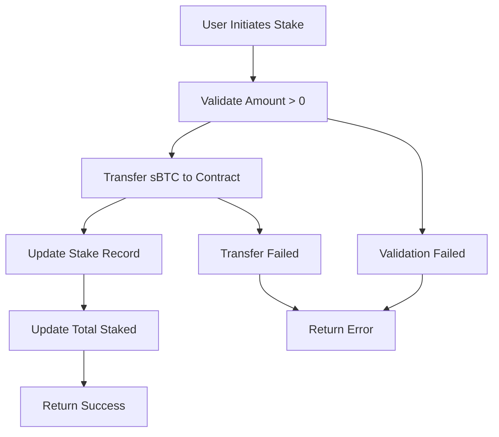
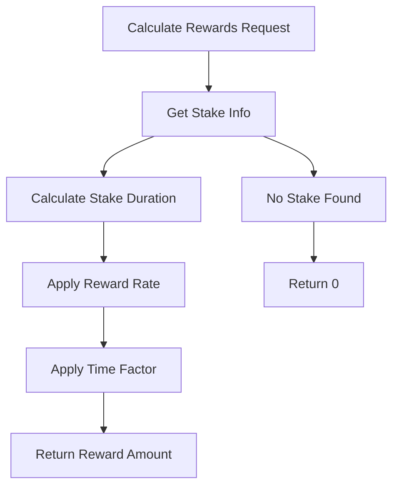
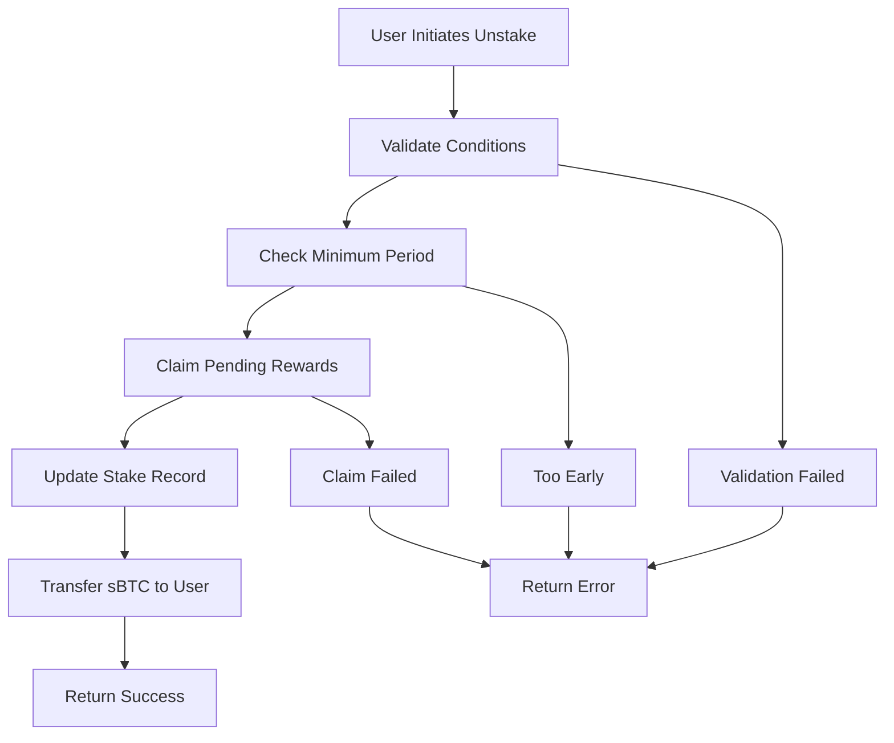

# BitStack Protocol

**Advanced Bitcoin Yield Optimization Framework**

[](https://opensource.org/licenses/MIT)
[](https://stacks.co)
[](https://bitcoin.org)

## Overview

BitStack Protocol revolutionizes Bitcoin yield generation through sophisticated smart contract architecture on the Stacks blockchain. By enabling non-custodial staking of sBTC, the protocol transforms idle Bitcoin holdings into productive assets while maintaining Bitcoin's core principles of decentralization and self-custody.

## Key Features

- **Non-Custodial**: Users retain full control over their Bitcoin assets
- **Flexible Staking**: Customizable staking periods with time-weighted rewards
- **Dynamic Rewards**: Automated yield calculation based on stake duration and amount
- **Security First**: Multi-tier admin controls and emergency safeguards
- **Institutional Ready**: Designed for both retail and institutional participants

## System Architecture

### Core Components

```
┌─────────────────┐    ┌─────────────────┐    ┌─────────────────┐
│   User Wallet   │    │  BitStack       │    │   sBTC Token    │
│                 │    │  Protocol       │    │   Contract      │
│ - Stake sBTC    │◄──►│                 │◄──►│                 │
│ - Claim Rewards │    │ - Stake Mgmt    │    │ - Transfer      │
│ - Unstake       │    │ - Reward Calc   │    │ - Balance       │
└─────────────────┘    │ - Admin Tools   │    └─────────────────┘
                       └─────────────────┘
                                │
                                ▼
                       ┌─────────────────┐
                       │  Reward Pool    │
                       │                 │
                       │ - Pool Balance  │
                       │ - Distribution  │
                       └─────────────────┘
```

### Contract Architecture

The protocol is built around four main functional areas:

#### 1. **Stake Management**

- **Primary Functions**: `stake()`, `unstake()`
- **Purpose**: Handle user deposits and withdrawals
- **Security**: Validates amounts, enforces minimum staking periods

#### 2. **Reward Engine**

- **Primary Functions**: `calculate-rewards()`, `claim-rewards()`
- **Purpose**: Calculate and distribute yield to stakers
- **Algorithm**: Time-weighted rewards based on stake duration and amount

#### 3. **Administration**

- **Primary Functions**: `set-reward-rate()`, `set-min-stake-period()`
- **Purpose**: Protocol governance and parameter management
- **Access Control**: Owner-only functions with validation

#### 4. **Analytics Interface**

- **Primary Functions**: `get-stake-info()`, `get-current-apy()`
- **Purpose**: Read-only functions for data access
- **Integration**: Enables frontend and analytics platforms

## Data Flow

### Staking Process



### Reward Calculation



### Unstaking Process



## Technical Specifications

### Reward Calculation Formula

```
Reward = (Stake Amount × Reward Rate × Time Factor) / 1000
```

Where:

- **Stake Amount**: User's staked sBTC balance
- **Reward Rate**: Current protocol rate (basis points)
- **Time Factor**: Duration-based multiplier (blocks staked / blocks per year)

### Key Parameters

| Parameter | Default Value | Description |
|-----------|---------------|-------------|
| Reward Rate | 5 basis points | 0.5% annual yield |
| Min Stake Period | 1,440 blocks | ~10 days minimum lock |
| Blocks Per Year | 52,560 blocks | Stacks blockchain metric |

### Error Codes

| Code | Constant | Description |
|------|----------|-------------|
| 100 | ERR_NOT_AUTHORIZED | Unauthorized access attempt |
| 101 | ERR_ZERO_STAKE | Invalid zero amount |
| 102 | ERR_NO_STAKE_FOUND | No active stake record |
| 103 | ERR_TOO_EARLY_TO_UNSTAKE | Minimum period not met |
| 104 | ERR_INVALID_REWARD_RATE | Invalid rate parameter |
| 105 | ERR_NOT_ENOUGH_REWARDS | Insufficient reward pool |

## Security Features

### Access Control

- **Owner-only Functions**: Critical protocol parameters
- **Input Validation**: All user inputs sanitized
- **State Verification**: Consistent state checks

### Economic Security

- **Minimum Staking Periods**: Prevent flash loan attacks
- **Reward Pool Validation**: Ensures sustainable payouts
- **Overflow Protection**: Safe arithmetic operations

### Emergency Safeguards

- **Owner Transfer**: Protocol ownership can be transferred
- **Parameter Updates**: Flexible rate and period adjustments
- **Pool Management**: Manual reward pool replenishment

## Integration Guide

### Frontend Integration

```javascript
// Example: Get user stake information
const stakeInfo = await contractCall({
  contractAddress: 'ST1...',
  contractName: 'bitstack-protocol',
  functionName: 'get-stake-info',
  functionArgs: [principalCV(userAddress)]
});

// Example: Calculate current rewards
const rewards = await contractCall({
  contractAddress: 'ST1...',
  contractName: 'bitstack-protocol',
  functionName: 'calculate-rewards',
  functionArgs: [principalCV(userAddress)]
});
```

### Analytics Integration

```javascript
// Get protocol metrics
const totalStaked = await contractCall({
  contractName: 'bitstack-protocol',
  functionName: 'get-total-staked'
});

const currentAPY = await contractCall({
  contractName: 'bitstack-protocol',
  functionName: 'get-current-apy'
});
```

## Deployment

### Prerequisites

- Stacks blockchain access
- sBTC token contract deployed
- Sufficient STX for deployment

### Environment Setup

1. Configure Stacks network parameters
2. Set up deployer wallet
3. Verify sBTC token contract address

### Contract Deployment

1. Deploy BitStack Protocol contract
2. Initialize reward pool
3. Set initial protocol parameters
4. Transfer ownership if required

## Governance

### Protocol Parameters

- **Reward Rate**: Adjustable by owner (0-100%)
- **Minimum Stake Period**: Configurable lock duration
- **Ownership**: Transferable to DAO or multisig

### Upgrade Path

- Parameter updates via owner functions
- Future versions may include additional features
- Backward compatibility maintained

## Risk Considerations

### Technical Risks

- Smart contract bugs or vulnerabilities
- Stacks blockchain network risks
- sBTC token contract dependencies

### Economic Risks

- Reward pool depletion
- Market volatility affecting yields
- Liquidity constraints during high demand

### Mitigation Strategies

- Extensive testing and auditing
- Conservative reward rate settings
- Emergency parameter adjustment capabilities
- Transparent reward pool management

## License

This project is licensed under the MIT License - see the [LICENSE](LICENSE) file for details.

## Contributing

We welcome contributions to BitStack Protocol. Please read our [Contributing Guidelines](CONTRIBUTING.md) before submitting pull requests.

## Support
